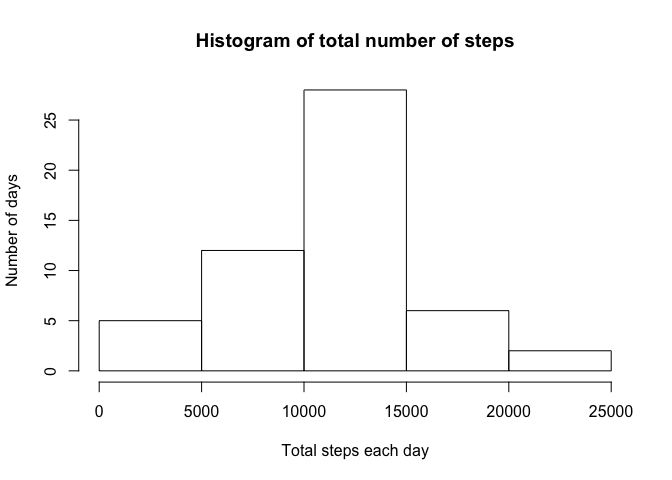
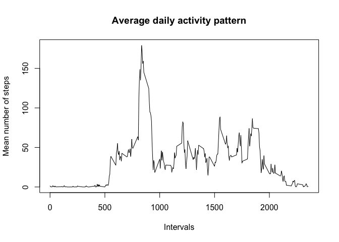
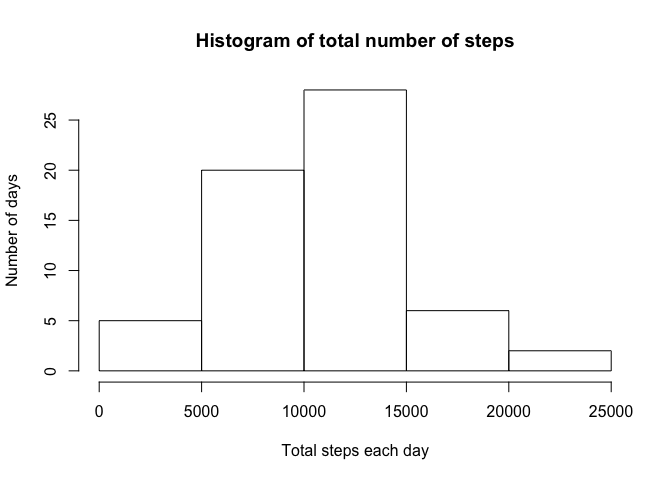
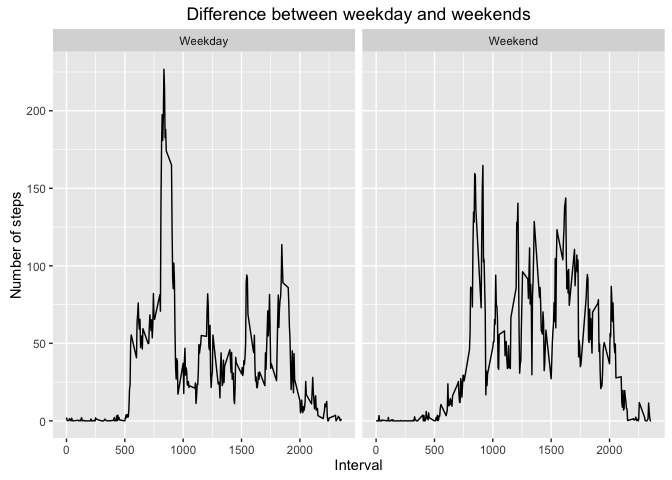

# Reproducible Research: Peer Assessment 1

## Loading and preprocessing the data


```r
rm(list=ls())
setwd("/Users/wenjian/Desktop/R programming/Reproducible Research/Assignment 1/RepData_PeerAssessment1/")
library(data.table)
data<-fread("activity.csv")
```

## What is mean total number of steps taken per day?

```r
result1<-data[,.(meansteps=mean(steps),totalsteps=sum(steps)),by=.(date)]
hist(result1$totalsteps,main="Histogram of total number of steps",xlab="Total steps each day", ylab="Number of days")
```

<!-- -->

```r
library(knitr)
kable(result1,col.names = c("Dates","Mean steps per day","Total steps per day"))
```


Dates         Mean steps per day   Total steps per day
-----------  -------------------  --------------------
2012-10-01                    NA                    NA
2012-10-02             0.4375000                   126
2012-10-03            39.4166667                 11352
2012-10-04            42.0694444                 12116
2012-10-05            46.1597222                 13294
2012-10-06            53.5416667                 15420
2012-10-07            38.2465278                 11015
2012-10-08                    NA                    NA
2012-10-09            44.4826389                 12811
2012-10-10            34.3750000                  9900
2012-10-11            35.7777778                 10304
2012-10-12            60.3541667                 17382
2012-10-13            43.1458333                 12426
2012-10-14            52.4236111                 15098
2012-10-15            35.2048611                 10139
2012-10-16            52.3750000                 15084
2012-10-17            46.7083333                 13452
2012-10-18            34.9166667                 10056
2012-10-19            41.0729167                 11829
2012-10-20            36.0937500                 10395
2012-10-21            30.6284722                  8821
2012-10-22            46.7361111                 13460
2012-10-23            30.9652778                  8918
2012-10-24            29.0104167                  8355
2012-10-25             8.6527778                  2492
2012-10-26            23.5347222                  6778
2012-10-27            35.1354167                 10119
2012-10-28            39.7847222                 11458
2012-10-29            17.4236111                  5018
2012-10-30            34.0937500                  9819
2012-10-31            53.5208333                 15414
2012-11-01                    NA                    NA
2012-11-02            36.8055556                 10600
2012-11-03            36.7048611                 10571
2012-11-04                    NA                    NA
2012-11-05            36.2465278                 10439
2012-11-06            28.9375000                  8334
2012-11-07            44.7326389                 12883
2012-11-08            11.1770833                  3219
2012-11-09                    NA                    NA
2012-11-10                    NA                    NA
2012-11-11            43.7777778                 12608
2012-11-12            37.3784722                 10765
2012-11-13            25.4722222                  7336
2012-11-14                    NA                    NA
2012-11-15             0.1423611                    41
2012-11-16            18.8923611                  5441
2012-11-17            49.7881944                 14339
2012-11-18            52.4652778                 15110
2012-11-19            30.6979167                  8841
2012-11-20            15.5277778                  4472
2012-11-21            44.3993056                 12787
2012-11-22            70.9270833                 20427
2012-11-23            73.5902778                 21194
2012-11-24            50.2708333                 14478
2012-11-25            41.0902778                 11834
2012-11-26            38.7569444                 11162
2012-11-27            47.3819444                 13646
2012-11-28            35.3576389                 10183
2012-11-29            24.4687500                  7047
2012-11-30                    NA                    NA

## What is the average daily activity pattern?

```r
data1<-as.data.frame(data)
data1[is.na(data1)]<-0    #remove NAs
data1<-as.data.table(data1)
result2<-data1[,.(meansteps=mean(steps)),by=.(interval)]
plot(result2$interval,result2$meansteps,type="l",xlab="Intervals",ylab="Mean number of steps",main="Average daily activity pattern")
```

<!-- -->

```r
result2<-result2[order(-meansteps)]
kable(head(result2,5),caption = "Top 5 intervals with highest activities", col.names = c("Top 5 intervals","Mean number of steps"))
```


Table: Top 5 intervals with highest activities

 Top 5 intervals   Mean number of steps
----------------  ---------------------
             835               179.1311
             840               170.2295
             850               159.3443
             845               156.0164
             830               154.0492

The interval with the highest mean number of steps is interval 835.

## Imputing missing values

```r
missingrow<-data[is.na(steps),.N]
```

1) There are 2304 number of missing rows.
2) Strategy for imputing missing numbers would be to replace NAs with the **mean for each interval**


```r
data2<-fread("activity.csv")
count=0
result2$meansteps<-as.integer(result2$meansteps)
for(i in 1:nrow(data2)){
        if(is.na(data2[i]$steps)){
                data2[i]$steps<-result2$meansteps[match(data2[i]$interval,result2$interval)]
                count=count+1
        }
}

cat("Total NA replaced is",count)
```

```
## Total NA replaced is 2304
```

```r
result3<-data2[,.(meansteps=mean(steps),totalsteps=sum(steps)),by=.(date)]
hist(result3$totalsteps,main="Histogram of total number of steps",xlab="Total steps each day", ylab="Number of days")
```

<!-- -->

```r
meanmedtotal1<-result1[!is.na(totalsteps),.(mean=mean(totalsteps),med=median(totalsteps))]
meanmedtotal2<-result3[,.(mean=mean(totalsteps),med=median(totalsteps))]

kable(meanmedtotal1,caption ="With NAs in data",col.names = c("Mean of total steps","Median of total steps"))
```


Table: With NAs in data

 Mean of total steps   Median of total steps
--------------------  ----------------------
            10766.19                   10765

```r
kable(meanmedtotal2,caption="With NAs replaced",col.names = c("Mean of total steps","Median of total steps"))
```


Table: With NAs replaced

 Mean of total steps   Median of total steps
--------------------  ----------------------
            10564.07                   10395

## Are there differences in activity patterns between weekdays and weekends?


```r
library(lubridate)
```

```
## 
## Attaching package: 'lubridate'
```

```
## The following objects are masked from 'package:data.table':
## 
##     hour, mday, month, quarter, wday, week, yday, year
```

```
## The following object is masked from 'package:base':
## 
##     date
```

```r
data2$date<-ymd(data2$date)
data2$weekday<-"factors" #Create a new column for ID-ing weekdays or weekends
    
for(i in 1:nrow(data2)){
                if(weekdays(data2[i]$date)=="Saturday" | weekdays(data2[i]$date)=="Sunday"){
                data2[i]$weekday<-"Weekend"
        } 
                else(data2[i]$weekday<-"Weekday") 
        }

resultwd<-data2[,.(meansteps=mean(steps)),by=.(interval,weekday)]

library(ggplot2)
ggplot(resultwd,aes(x=interval,y=meansteps))+
        geom_line()+
        facet_wrap(~weekday)+
        xlab("Interval")+
        ylab("Number of steps")+
        ggtitle("Difference between weekday and weekends")
```

<!-- -->
